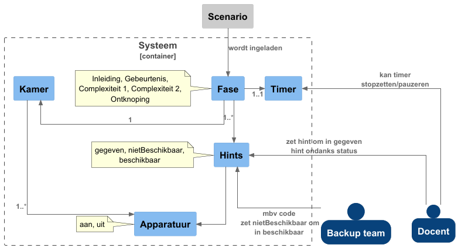

# Scenario doorloop in simulator
Een scenario moet doorlopen worden in een simulator. 
De manier waarop dat moet gebeuren staat hier beschreven.
Daarnaast is er een diagram om de inhoud van de container te visualiseren.
We hebben hiervoor de scenariohandleiding van het Praktijkhuis AGV gebruikt.

## Stappenplan
Voor elke fase:
1. Start fase timer
2. Stuur apparatuur aan
3. Doorloop alle hints van de fase (Tester bepaalt welke hint op welk moment gegeven worden)
4. Als fase afgelopen is (fase timer is afgelopen of docent stopt timer)  
        Dan ga je naar volgende fase

## Diagram
Het diagram hieronder laat zien dat een fase bestaat uit een timer, een kamer en hints.
De kamer heeft apparatuur.
De hints hebben een status, net als de apparatuur. 
De docent en het back-up team kunnen ervoor zorgen dat hints gegeven worden.
De docent kan ook invloed uitoefenen op de timer.

