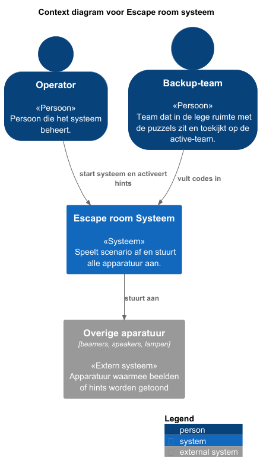
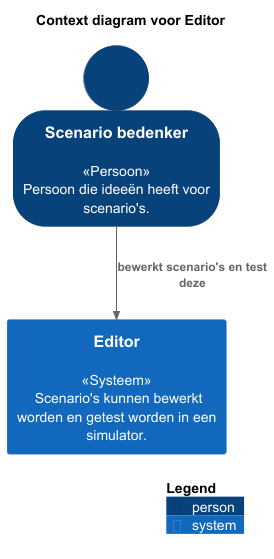

# Context

Het volgende diagram laat zien welke personen (actoren) en externe systemen interactie hebben met het systeem voor de escape room.
Dit diagram wordt ook wel een context diagram genoemd.

De operator en het backup-team sturen het systeem aan.
De operator zet het systeem aan en kan tijdens het scenario hints activeren, zodat het active-team verder kan.
Het backup-team vult codes in het systeem, zodat ook hints geactiveerd worden voor het active-team.
Het systeem stuurt de apparatuur aan, zoals beamers, speakers en lampen.  

Het volgende context diagram gaat over de editor, waar de simulator in zit. 
Hierbij is alleen een scenario bedenker betrokken en zijn er geen externe systemen.

