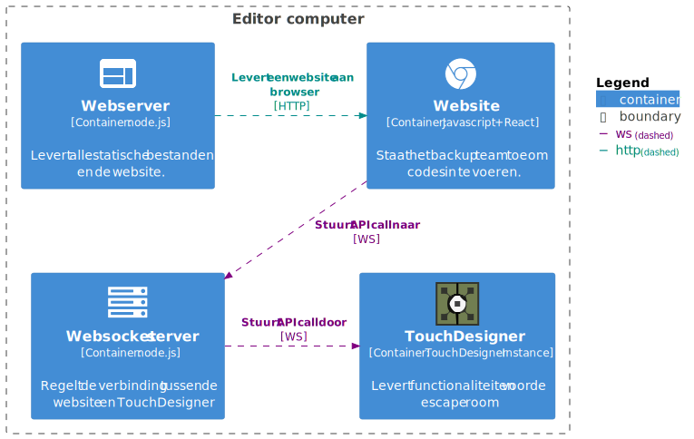
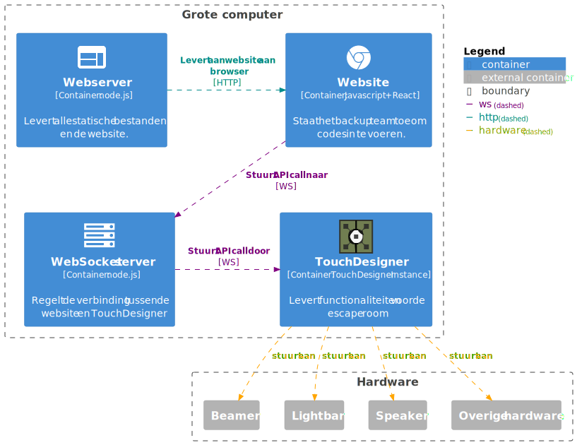
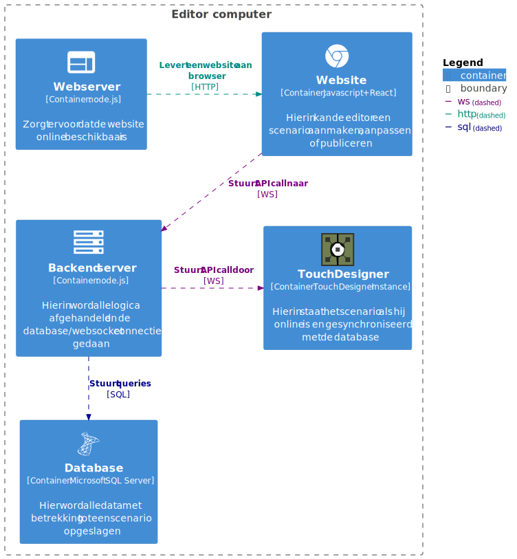
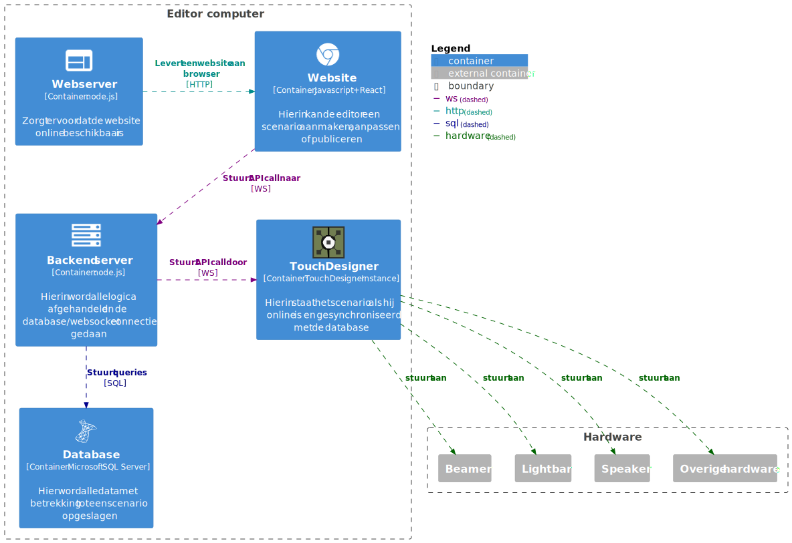

# Deployment

Dit hoofdstuk geeft aan hoe verschillende softwarecomponenten met elkaar communiceren en hoe deze gestart kunnen worden.

## Walking Skeleton 1

### Editor

Het onderstaande diagram toont de onderdelen die op de computer van de scenariomaker moeten draaien om de editor te gebruiken.
Deze onderdelen zijn:
- Een webserver die de website levert
- Een WebSocket server die de communicatie tussen de website en TouchDesigner regelt
- TouchDesigner waar scenario's in worden opgeslagen
- De website waarin een scenariomaker een scenario kan ontwikkelen

### Besturing

Het onderstaande diagram toont de onderdelen die op de grote computer moeten draaien om de Escape Room te besturen.
Dit zijn dezelfde onderdelen als bij de editor, alleen heeft de grote computer verbinding nodig met de hardware.

### Setup

Om de software te starten moet [TouchDesigner 2023](https://derivative.ca/download/archive) en [Node.js v22](https://nodejs.org/en/download) geïnstalleerd zijn. TouchDesigner draait alleen op MacOS en Microsoft Windows.

#### WebSocket server

1. Navigeer naar de folder `producten/walking-skeleton/versie 1/backend/escape-room-backend`
2. Open de terminal in deze folder met rechtermuisklik
3. Voer het commando `node server.js` uit

#### Webserver

1. Navigeer naar de folder `producten/walking-skeleton/versie 1/frontend/escape-room-frontend`
2. Open de terminal in deze folder met rechtermuisklik
3. Voer de commando's `yarn install`, `yarn build` en `yarn preview` uit
4. Bezoek de getoonde URL (meestal http://localhost:4173/)

#### TouchDesigner

1. Navigeer naar de folder `producten/walking-skeleton/versie 1/backend/TouchDesigner`
2. Open het bestand `prototype_TD_combi..toe`

---

## Walking Skeleton 2

### Editor

Het onderstaande diagram toont de onderdelen die op de computer van de scenariomaker moeten draaien om de editor te gebruiken.
Deze onderdelen zijn:
- Een webserver die de website levert
- Een backend server die de communicatie tussen de website, database en TouchDesigner regelt. Hierin bevindt zich ook de alle logica.
- TouchDesigner voor het synchroniseren van de data 
- De website waarin een scenariomaker een scenario kan ontwikkelen
- De database waarin alle data wordt opgeslagen

### Besturing

Het onderstaande diagram toont de onderdelen die op de grote computer moeten draaien om de Escape Room te besturen.
Dit zijn dezelfde onderdelen als bij de editor, alleen heeft de grote computer verbinding nodig met de hardware.

### Setup

Om de software te starten moet [TouchDesigner 2023](https://derivative.ca/download/archive), [Node.js v22](https://nodejs.org/en/download) en [Docker Desktop](https://www.docker.com/products/docker-desktop/) geïnstalleerd zijn. TouchDesigner draait alleen op MacOS en Microsoft Windows.
Verder raden wij [SQL Server Management Studio](https://learn.microsoft.com/en-us/ssms/install/install) aan om de database te beheren.

#### Database

1. Start Docker Desktop
2. Wacht tot Docker Engine volledig is opgestart
3. Navigeer naar de folder `producten/walking-skeleton/versie 2/database`
4. Open de terminal in deze folder met rechtermuisklik
5. Voer het commando `docker run -e "ACCEPT_EULA=Y" -e "MSSQL_SA_PASSWORD=password123!" -p 1433:1433 --name escaperoom --hostname escaperoom -d mcr.microsoft.com/mssql/server:2022-latest` uit
6. Start SQL Server Management Studio op
7. Verbindt met SQL Server Authentication met `localhost,1433`. De gebruikersnaam is `sa` en het wachtwoord `password123!`. Vink ook Trust Server Certificate aan.
8. Voer het bestand `CREATE.sql` en `DATA.sql`uit

#### Backend server

1. Navigeer naar de folder `producten/walking-skeleton/versie 2/backend`
2. Open de terminal in deze folder met rechtermuisklik
3. Voer het commando `node server.js` uit

#### Webserver

1. Navigeer naar de folder `producten/walking-skeleton/versie 2/frontend`
2. Open de terminal in deze folder met rechtermuisklik
3. Voer de commando's `yarn install`, `yarn build` en `yarn preview` uit
4. Bezoek de getoonde URL (meestal http://localhost:4173/)

#### TouchDesigner

1. Navigeer naar de folder `producten/walking-skeleton/versie 2/touchdesigner`
2. Open het bestand `autostart.toe`