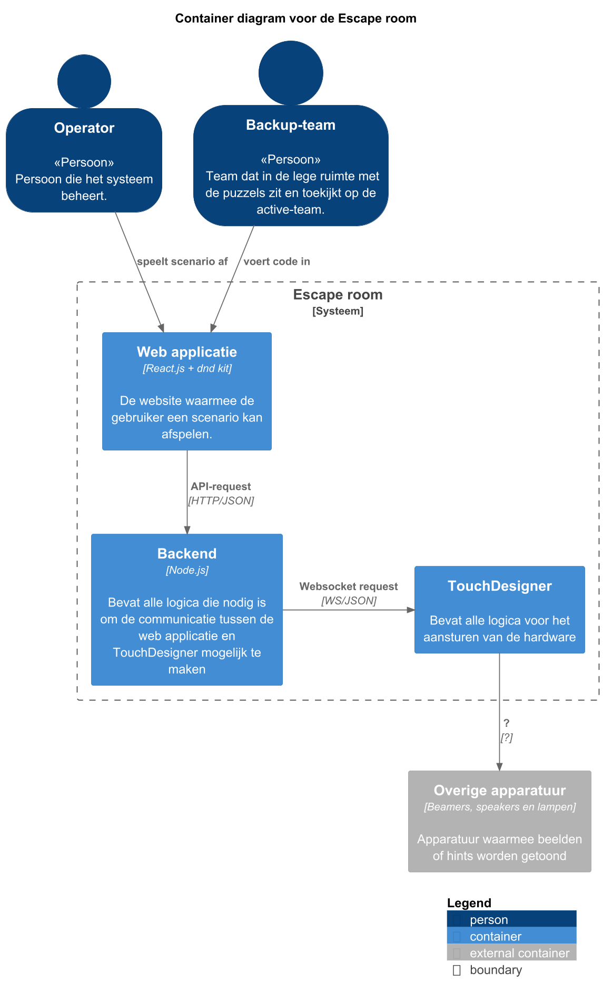
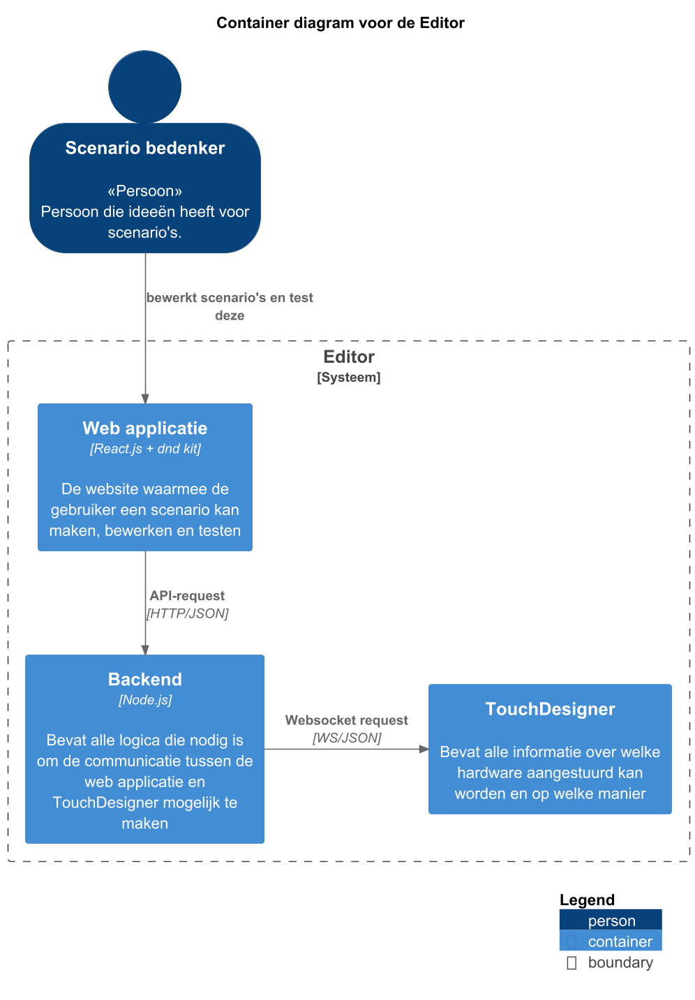
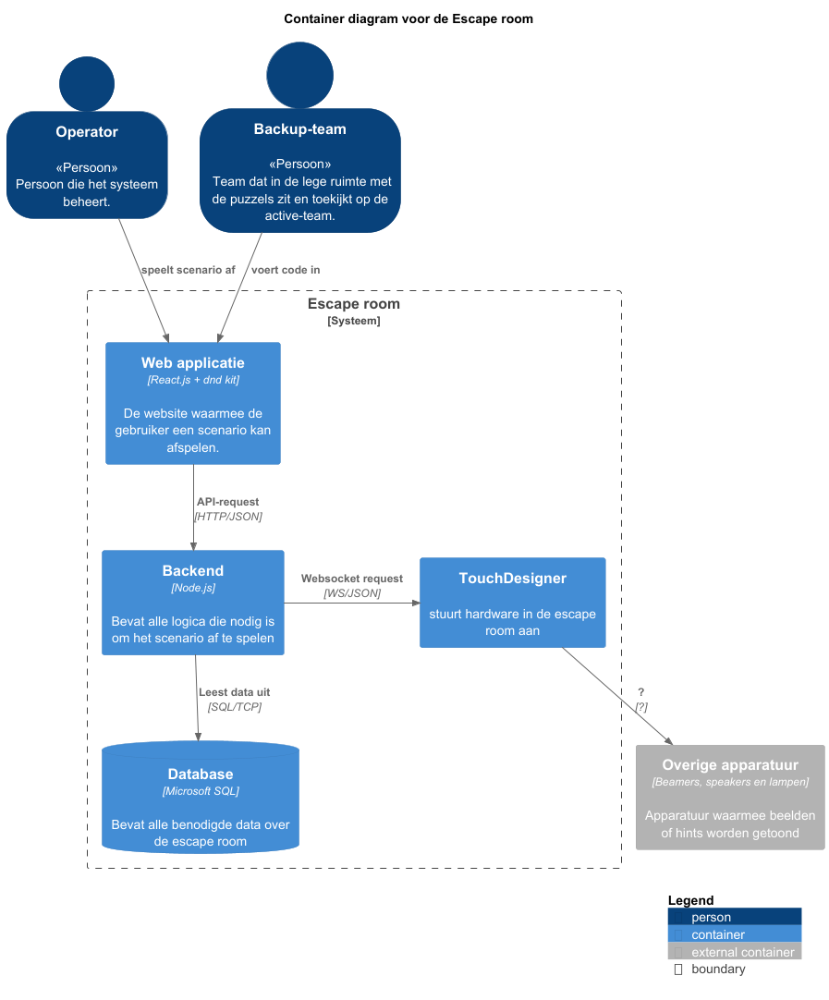
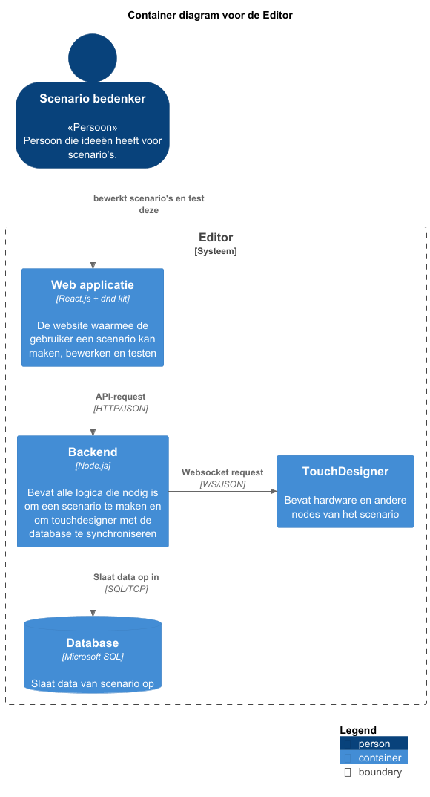

# Software architectuur

In dit hoofdstuk wordt de structuur van de code weergegeven. 
Dit wordt weergegeven door middel van container diagrammen en component diagrammen.
Een container diagram laat zien welke onderdelen het systeem heeft. 
Een component diagram gaat een niveau dieper en kijkt naar de onderdelen van een container.
Steeds staat de gebruikte technologie tussen blokhaken onder de titel van de container of het component.

## Containers walking skeleton 1

Het container diagram van de escape room en de editor lijken veel op elkaar. 
Hieronder wordt eerst het container diagram van de escape room weergegeven.

  

In bovenstaande diagram wordt weergegeven dat een docent of back-up team interactie heeft met de webapplicatie.
De webapplicatie communiceert via een API-request met de backend, die de communicatie met TouchDesigner mogelijk maakt.
De backend communiceert met TouchDesigner via websockets.
TouchDesigner bevat alle logica om de overige apparatuur aan te sturen.

Een API-request is een manier waarop websites met andere systemen kunnen communiceren.
Websockets zijn een manier waarmee een live verbinding tussen twee of meerdere apparaten / applicaties gemaakt kan worden. Hierbij kunnen er continu berichten naar alle verbonden apparaten verstuurd worden.

Het container diagram van de editor wordt hieronder weergegeven.

Voor de editor heeft de backend contact met TouchDesigner om te weten te krijgen welke typen hardware beschikbaar zijn en hoe die aangestuurd moeten worden.

## Containers walking skeleton 2

In het tweede walking skeleton wordt er gebruik gemaakt van een database. 
Hierin staat alle data die nodig is om de escape room te doen.
De backend maakt connectie met de database om gegevens op te halen.
De backend heeft altijd verbinding met TouchDesigner nodig om een scenario in de escape room af te spelen.

  

In dit diagram is weergegeven dat de backend verbonden is met TouchDesigner, dit is niet altijd het geval.
De verbinding is alleen nodig als Touchdesigner gaat synchroniseren met de database en de benodigde apparaten uit TouchDesigner nodig heeft.
De backend is verbonden met de database en slaat de data op.

