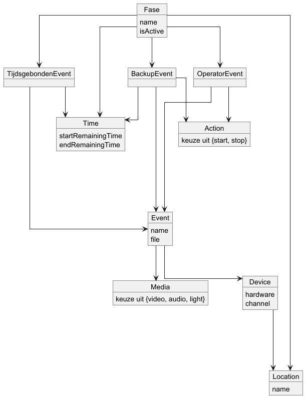
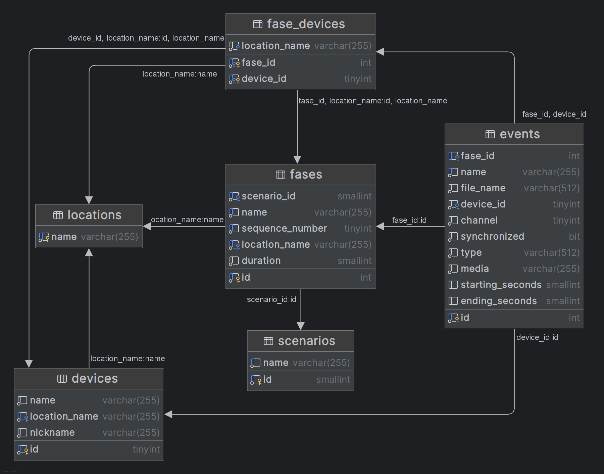

# Data

## 1e walking skeleton
De data uit dit project wordt niet opgeslagen in een database, maar in een TouchDesigner bestand.
Hierin staat dus wanneer en waar welke hints en achtergrondbestanden worden getoond.
Onderstaand figuur is het datamodel dat in de frontend wordt gebruikt als structuur.

Een scenario bestaat uit fases.
Een fase heeft een naam en een variabele die bijhoudt of de fase actief is. 
Daarnaast hoort een fase bij een locatie.
Verder heeft een fase backup-events, operator-events en tijdsgebonden events.
Alle drie bevatten events die dit uitvoeren.
Backup-events en operator-events hebben een actie.
Dit kan start of stop zijn.
Backup-events hebben net als een tijdsgebonden event een tijd (begin- en eindtijd).

Events hebben een bestand, een naam en een soort media.
Dit kan licht, geluid of video zijn.
Een event heeft ook een apparaat waarop het afgespeeld wordt.
Een apparaat heeft een locatie, het soort hardware en verschillende kanalen.

## 2e walking skeleton

De data wordt grotendeels opgeslagen in de database.
Hieronder staat een datamodel van de database.

Hierin staan de tabellen van de database.
Daarnaast staat in elke tabel de naam van de kolommen met het type.
In elke tabel is er een primary key (een kolom die afdwingt dat die uniek is).
Dit is weergegeven met een gele sleutel voor de kolomnaam, zoals bij de kolom 'name' in de locatie-tabel.
Tabellen zijn naar elkaar gelinkt met foreign keys. 
Dit zijn kolommen die verwijzen naar kolommen van andere tabellen. 
Deze zijn weergegeven met een blauwe sleutel voor de kolomnaam.
Een voorbeeld hiervan is het scenario-id bij de fase-tabel.
Als laatste zijn er nog unieke keys, weergegeven met een blauw randje. 
Deze dwingen af dat de kolom ook uniek is, zoals de naam van het event.
Het rondje aan de linkerkant van de kolom niet leeg mag zijn.

In de event-tabel zijn er bepaalde checks die de database controleert.
Er zijn drie type events: tijdsgebonden, backup of operator.
Als het type operator is, dan moeten de start- en eindtijd leeg zijn.
Media kan licht, geluid of audio zijn.
Daarnaast kan een channel 0, 1 of 2 zijn.
Dit verwijst naar de achtergrond of voorgronden.

In de fase-tabel staat een scenario-nummer en een sequence-nummer.
Het sequence-nummer geeft aan wat de volgorde is van de fases in een scenario.

De devices-tabel heeft naast een naam ook een nickname, zodat de gebruiker het apparaat een herkenbare naam kan geven.
Daarnaast heeft een apparaat een locatie.

In het datamodel staat de fase_devices-tabel, deze tabel bestaat om ervoor te zorgen dat een event enkel aan een fase en apparaat gekoppeld kan worden als die in dezelfde locatie zijn.
Het is de verantwoordelijkheid van de database om ervoor te zorgen dat de fase_devices tabel kloppend is als een nieuwe fase of device toegevoegd wordt.
Dit kan gedaan worden doormiddel van een database trigger die uitgevoerd wordt wanneer een nieuwe rij wordt toegevoegd aan de fases- en devices-tabellen.
